# Definitional outline

The published glossary is in [tractate.md](tractate.md).

Every term below is introduced at the tagged proposition in [tractate.md](tractate.md). Arrow `A --> B` reads: A is defined in terms of B.

## Terms

| Term | Brief description | Defined at | Depends on |
| --- | --- | --- | --- |
| mind | Realm of thoughts. Thoughts cannot be physically interacted with. The body hosts the mind; what happens to the body reaches it. | 1.0, 1.4, 1.5 | 1.1, 1.2 |
| body | Physical substance that hosts the mind, is moved by it, and supplies it with sensory data about the environment. | 1.1, 1.2, 1.4, 1.5 | 1.0 |
| environment | Area immediately outside the body, beginning at the limits of the physical body, where sensory inputs find themselves. | 1.3 | 1.2 |
| recall | Storage of information that can be freely recalled: thoughts, sensory recordings. | 1.61, 1.64 | 1.6 |
| imprint | Storage of information impressed by environment: habits and the like; drives without being recalled. | 1.61, 1.62, 1.64 | 1.6, 1.3 |
| two modalities of memory | Recall and imprint; the "I" is a property of the mind-body feedback system and of both stores. | 1.64 | 1.61, 1.62, 1.63 |
| "I" | The self as a property of the mind-body feedback system and of the two modalities of memory. | 1.64 | 1.61, 1.62, 1.63 |
| communication | Using the body to interface with the environment to emit and encode information (speech, gesture, writing). | 2.1 | 1.0, 1.1, 1.3 |
| worldview | Assumptions structurally embedded through communication; constituents of sense of self. | 2.3 | 2.2 |
| physical remnant | What can still be encountered with the senses as leftover of what the stories are about; destroyable or modifiable. | 3.2 | 3.02, 1.6 |
| social remnant | Remnant that is not an inspectable object: in the given language, in unspoken conduct, in arrangements already producing conduct. | 3.3 | 1.64, 2.2 |
| history | The story as it reaches me, passed down through physical remnant and social remnant; analogous to mind. | 3.5 | 3.2, 3.3, 1.64, 1.0 |
| bone | The hard part of the body; what stays longest; laid down slowly; closer to acted-on than acting. Stands in the place of the physical remnant. | 4.01, 4.1 | 4.0, 3.2, 3.5 |
| soft system | The nervous system; what registers as it happens and changes with what happens to it. Stands in the place of the social remnant. | 4.02, 4.1 | 4.0, 3.3, 3.5 |
| principality | A bounded group of groups of related responses in the soft system; made of smaller principalities, belonging to a larger one. | 4.31 | 4.02, 4.3, 4.32, 4.33 |
| nesting | Each principality answers mostly to those nearest it, below and above; nothing sits outside running the whole from a single point. | 4.33 | 4.31 |
| scale likeness | The same kind of arrangement appears above the body and below it; analogous at scale. | 4.34 | 4.31, 4.33 |
| likeness taken as identity | Scale likeness no longer held as likeness and treated as a readable identity (tarot, zodiac, and the like). | 4.341 | 4.34 |
| the gap | No mind is read without traversing the environment; intentions are not met directly. | 5.0 | 1.3, 2.11 |
| representation of another mind | A held model of another's worldview, close enough that motivations can be inferred from it, under constant refinement. | 5.02 | 5.0, 2.3 |
| record | What interactions leave in the environment; of the same kind as the physical remnant and the bone. | 5.03 | 3.2, 4.01, 5.02 |
| intention attribution | Requires multiple signals pointing toward a goal that is fathomable and can be weighed against the originating mind's worldview. | 5.11 | 5.1, 5.02 |
| hardened record | The part of a principality's action that survives the telling and can still be inspected; durable relative to recall, not fixed as bone is fixed. | 5.14, 5.141 | 3.2, 4.01, 5.03, 2.2, 3.6, 7.2 |
| fruits | A principality known by what was actually done, weighed against worldview; the self is one piece of that fruit when membership is legible. | 5.15, 5.151 | 5.03, 5.14, 4.31 |
| fair representative | Once another mind reads me as inside a principality, I am its concept as they hold it; fairness is the part still mine to choose. | 5.151 | 5.15, 5.13 |
| foregrounding | Situations where membership itself is under scrutiny (me-as-employee, me-as-countryman, me-as-family). | 5.152 | 5.151, 5.13 |
| authenticity | A mind or principality is authentic so far as the story it tells of itself stays close to the hardened record of what it produced. | 5.17 | 5.14, 5.1, 5.16 |
| self | The "I" that the mind understands itself to be, of both modalities of memory. | 6.0, 6.01 | 1.0, 1.1, 1.64 |
| role | The concept of a principality as another mind holds it when it looks at me, in situations where that membership is under scrutiny. | 6.05 | 5.151, 5.152, 6.04 |
| standard | For any given role, the implicit measure of what counts as carrying it out well. | 6.14 | 6.04, 6.05, 5.151 |
| ideal | The arrangement of standards I would arrive at if I stopped and set it, instead of letting it default. | 6.16 | 6.15, 6.14 |
| default order | Where I do not stop to order my standards, the order supplied by whichever standard belongs to the principality nearest me. | 6.17 | 4.33 |
| authentic self | A mind holding its story to its hardened record, setting the order of standards, and acting on the difference; currently doing both refinements. | 6.2, 6.22 | 6.1, 6.12, 6.16, 6.17 |
| consistent self | A self that matches its own record and never set anything by 6.16, only reporting the shape 6.17 supplies. | 6.3 | 6.1, 6.16, 6.17 |
| fairness | A fair representative of a role has a standard set for that role and keeps revising how well it is met by what was done. | 6.5 | 5.151, 6.16, 6.12 |
| contact error | Taking the remnant, or the story told about it, for the thing itself. | 7.1 | 5.0, 3.5, 5.03 |
| reader error | The reader was conditioned by what is being read; what goes wrong was impressed into the reader before any sensing. | 7.2 | 2.2, 2.3, 3.6, 5.14 |
| inscription error | Taking the recalled story for the whole of what is driving; the imprint landed where recall cannot reach. | 7.3 | 1.64, 1.61, 1.62, 6.02 |
| scale error | Taking the scale one happens to be standing on for the whole pattern. | 7.4 | 4.31, 4.33, 4.34 |
| observer | A principality reading other principalities' remnants, with a reader those remnants had a hand in conditioning. Observation is a second reading of a remnant. | 7.5 | 7.1, 7.2, 4.31 |
| mitigation | Changing how much of the self's shaping goes through unexamined. | 8.21 | 6.11, 8.2 |
| chosen | A membership whose foregrounding I can find myself having done: mine to take up or set down. Relative to the observer. | 8.22, 8.23 | 5.152, 7.5, 7.4 |
| placed | A membership already there before any such pointing; what I can find is that I am already being read as inside it. Relative to the observer. | 8.22, 8.23 | 5.152, 2.2, 7.5, 7.4 |
| weight | Stored potential behind a response whose magnitude does not correspond to the subject taken on its own; stored in the soft system; the subject is the key, not the source. | 9.0, 9.01 | 4.02, 4.32, 7.3 |
| emotional landscape | Inner space whose geography is determined by accumulated experience; a space in which a mind's notions exist and relate to one another. | 9.1 | 2.1, 2.2 |
| uncreated territory | Territory left uncreated if the mind has not witnessed a specific state of affairs; it does not exist as empty space. | 9.11 | 9.1 |
| gravity likeness | Weight sits in the emotional landscape the way a mass sits in physical space; a high-weight notion pulls on the notions nearest it. | 9.12 | 9.01, 9.1 |
| singularity | A region in the emotional landscape where the distortion is enough that the ordinary shape will not hold. | 9.13 | 9.12, 9.0 |
| boundary | A region at the foundation of worldview that drives contemplation away; attention pushed off a subject. | 9.3, 10.22 | 10.2 |
| momentariness | Followed far enough, there is no self left to point at: self as a series of separate moments. | 10.1 | 10.0, 10.01 |
| flame | The base act of self; attention. The fathom is spent wherever attention is. | 10.12, 10.2 | 10.11, 4.02 |
| fathom | The span a flame takes; a floor below which "self" stops being something that can be pointed at. | 10.12, 10.14 | 4.02, 10.1, 10.11 |
| Primordiant | The superset from which abstractions and implementations emerge; preceded the beginning of time; holding every present instant. | 11.41, 11.411, 11.412 | 11.0, 11.12, 11.4, 10.12, 10.2 |
| form | The shape outlined by a set of relations; not one thing sitting alone. | 12.0 | 11.2, 11.21, 12.1 |
| relation | One end the remnant, the other the reader; observation is that relation. | 12.1 | 7.1, 7.2 |
| resolution | More relations, and the resolution of the shape is finer; fewer, and it is coarser. | 12.01 | 12.0, 11.2, 11.21 |
| etch | Repeating a relation already made across further fathoms, with the reader as one end; the relation can later be found as imprint without a return through the senses. | 12.121 | 12.12, 12.1, 4.32, 1.2 |
| degrees of falsehood | Truth treated as the far end of a grading, asymptotic, approached and not reached; what is had are degrees of falsehood. | 12.21 | 7.1, 7.2, 7.4, 5.14, 5.1, 7.0 |
| light | Likeness for the act of observation; full light would be the form with no remainder of miss. | 12.22 | 12.0 |
| shade | Where illumination stops; a silhouette has the outline and none of the substance. | 12.22 | 12.0 |
| evil | Shade, not a second kind of being; how far the "I" stands from the form, and which face of the form the relation is using. | 12.23 | 12.22, 5.1, 5.17 |
| suffering | A shade of that shade. | 12.23 | 12.22 |
| happenstance shade | The form left free to be itself, occupying a distance another form cannot take; the cost of a form being a form. | 12.32 | 12.0, 12.22 |
| infliction | The same form turned: someone faced the lit side and used the unlit side; what is added is the choosing. | 12.33 | 12.32, 8.2, 11.41 |
| night | The shade of a light that has gone around, or gone down; if evil is a shade, it is night. | 12.341 | 12.23 |
| darkness | The case with no day in it; no contour; no form left to cast a shade. | 12.341 | 12.0 |
| death | The body ending: the soft system stops, and what it was holding is not observed coming along with the bone. | 13.0 | 4.03 |
| fade | The natural ending, where the nervous system fails by degrees and the hard part is what stays longest. | 13.01 | 4.01, 4.03, 13.0 |
| final singularity | The last floor, by likeness to 9.13: arrived at by the soft system stopping, not by a subject acting as the key that releases weight. | 13.12 | 9.13, 9.131, 9.01, 10.12, 10.14 |
| free will | A spectrum; unadulterated free will only to the degree the body and the established landscape of the mind can permit. | 14.0, 14.01 | 4.01, 9.031, 9.12, 12.21 |
| degrees of freedom | A function of the level of authenticity of self, and of the resolution of mapping the mind has. | 14.1, 14.11 | 6.03, 6.22, 6.3, 12.01 |
| analogy | A likeness held as a likeness: the same shape pointed at somewhere else, then a return. | 15.0 | — |
| metaphor | A substitution that finishes inside one fathom; the likeness claimed as a usable identity for that span. | 15.1 | 10.12, 10.2, 9.03 |
| allegory | A sequence of relations that does not finish inside one fathom; the shape is outlined only after a series of acts, distances, and consequences. | 15.2 | 12.0, 12.3, 11.21, 10.12 |
| attachment | A notion drawing me toward another notion, where the notion that draws is usually one already associated with the self; there are cases where no such notion is there yet. | 16.0 | 6.0, 16.03, 16.11 |
| wearing | What I meet is taken as wearing a notion, another mind or an aspect such as sex, money, or power; the same act from the other end as reading a role. | 16.01 | 7.1, 5.0, 9.1, 6.05, 5.151 |
| love | Attachment when the other end is held as a mind I could fathom. A stipulated use. | 16.02 | 16.0, 5.02, 12.01 |
| lust | Attachment when the other end is held as an aspect. A stipulated use, at the coarser end of one run and not a second kind. | 16.02 | 16.0, 12.01 |
| familial love | Love where the other mind is placed, and the attachment can be there before an "I" who could have set it; fondness and closeness are the same attachment, coarser or finer by the relations in the shape worn. | 16.03 | 16.02, 8.22, 2.2, 12.01 |
| yearning | The draw toward the notion worn. | 16.1 | 16.0, 16.01 |
| hate | Attachment where the draw is away: the notion associated with the self draws away from the notion worn. Can enhance focus, and can show up similar to love. | 16.1 | 16.0, 16.01 |
| contempt | Attention pushed off so the relation is not made; the weight can remain after I stop taking them as wearing the notion. | 16.1 | 12.12, 9.01 |
| taboo | The bend where the weight is a property of the region across many minds, carried in by the installed means of communication and already in the social remnant. | 16.2 | 9.12, 9.2, 2.2, 3.3, 4.341 |

## Master map

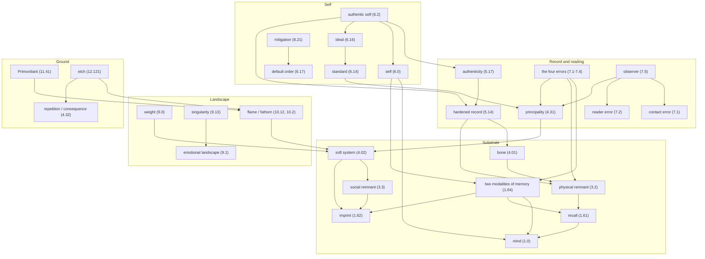

## Detail maps

### Mind, body, memory (sections 1-3)

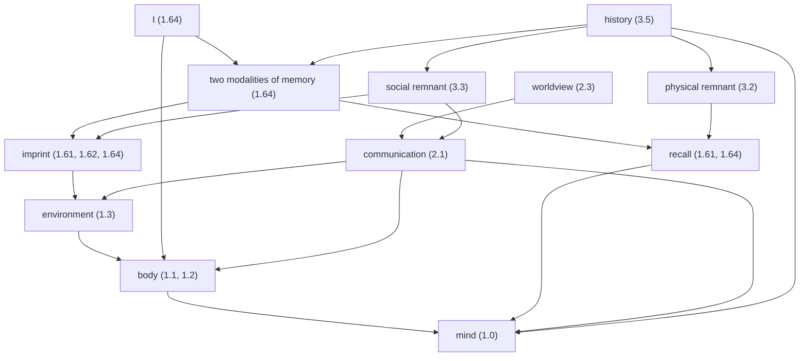

### Bone, soft system, principality (section 4)

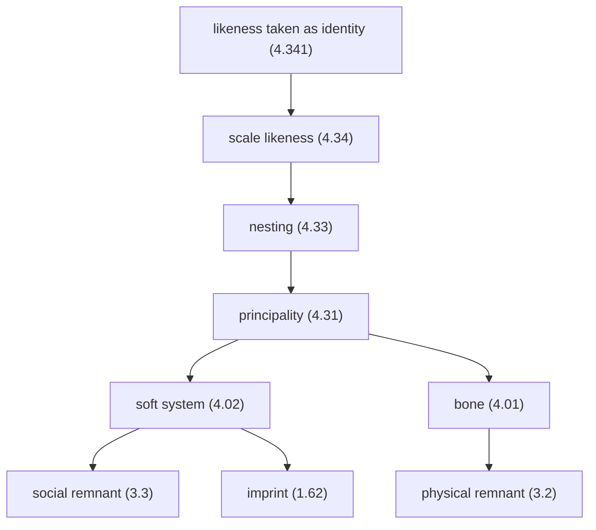

### Doubt and record (section 5)

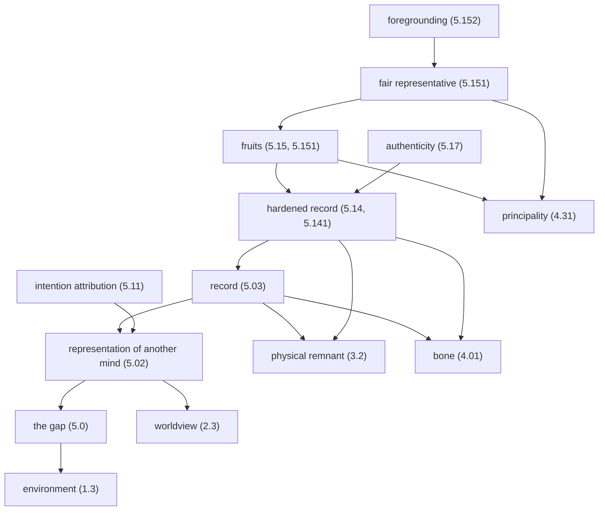

### Self (section 6)

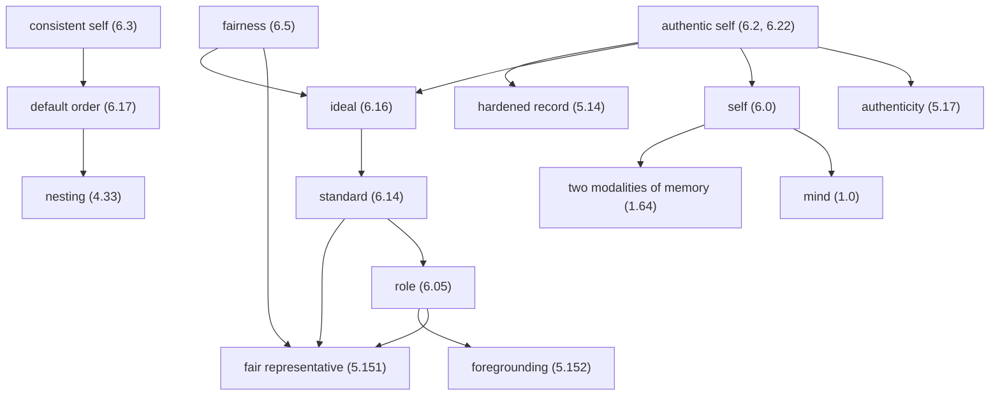

### Errors (section 7)

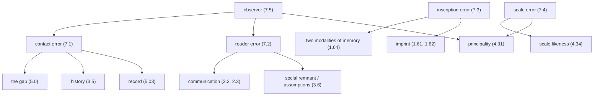

### Motivation (section 8)

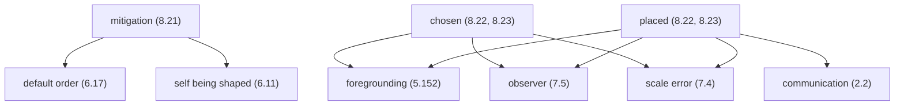

### Weight and landscape (section 9)

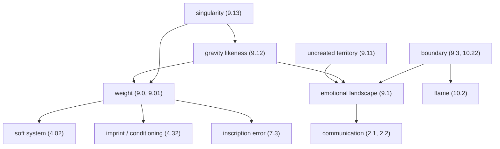

### Flame, fathom, death (sections 10, 13)

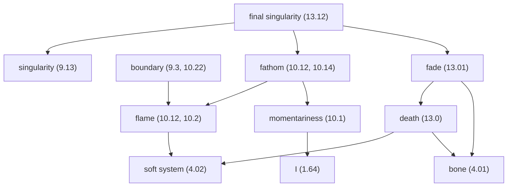

### Ground, form, will, figures (sections 11, 12, 14, 15)

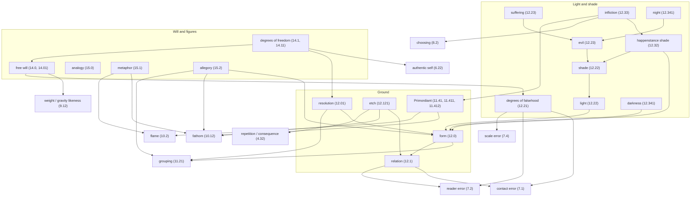

### Attachment (section 16)

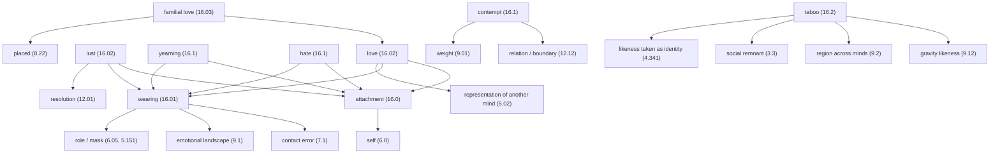
